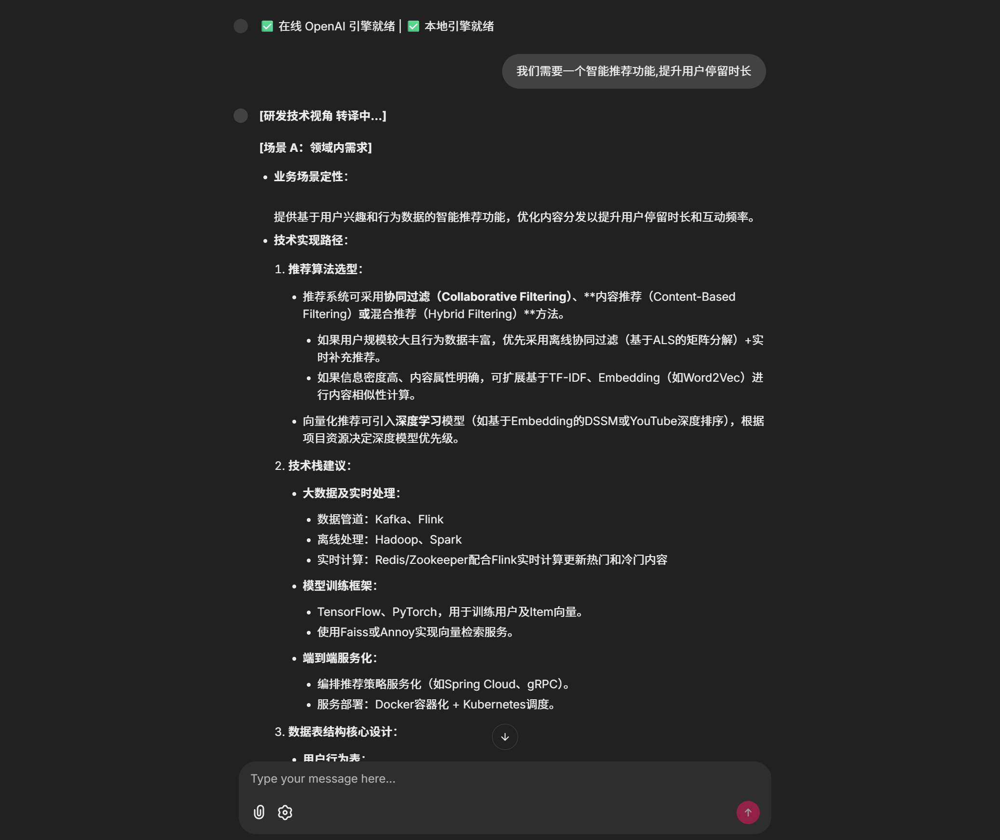
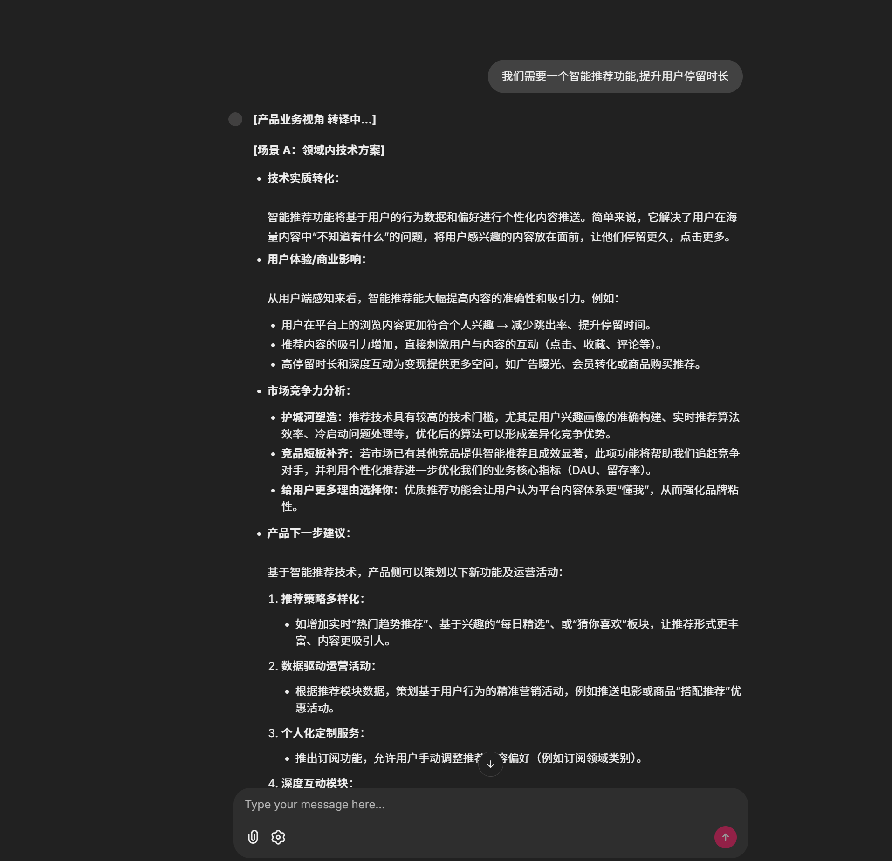

# TranslationAssistant


✨ **TranslationAssistant** 职能沟通翻译助手是一款专注于解决产品经理与研发工程师之间沟通障碍的智能翻译工具，通过双向语言转换帮助双方准确理解彼此的专业表述，降低沟通成本，提升协作效率。

🔌 **Multi-provider support**: 支持在线推理和本地推理模型 

💰 **Token tracking**: Detailed usage metrics and cost tracking  

⚡ **Flexible deployment**: Chainlit, FastAPI   


## 功能说明 


## 📸 产品截图

### 主界面


### 推理引擎和agent切换


### 产品输入


### 研发输入



### 在线接口文档


## Quickstart
```bash
# 创建虚拟环境
python3 -m venv venv 

source  ./venv/bin/activate

pip3 install -r requirements.txt -i https://pypi.tuna.tsinghua.edu.cn/simple 


# 修改配置
在根目录下将.env_template 修改为 .env
在其中填写：
在线模型：openai的key,base_url以及所使用模型等信息
本地模型：模型名称 及模型路径, 默认本地模型放置于modules/checkpoints目录下


# 启动服务
python3 lanuch.py 

# 后台运行
nohup python3 lanuch.py   > output.log 2>&1 &

```

## Usage


## todo


## Observability

## Advanced Usage


## License

This project is licensed under the Apache 2.0 License.