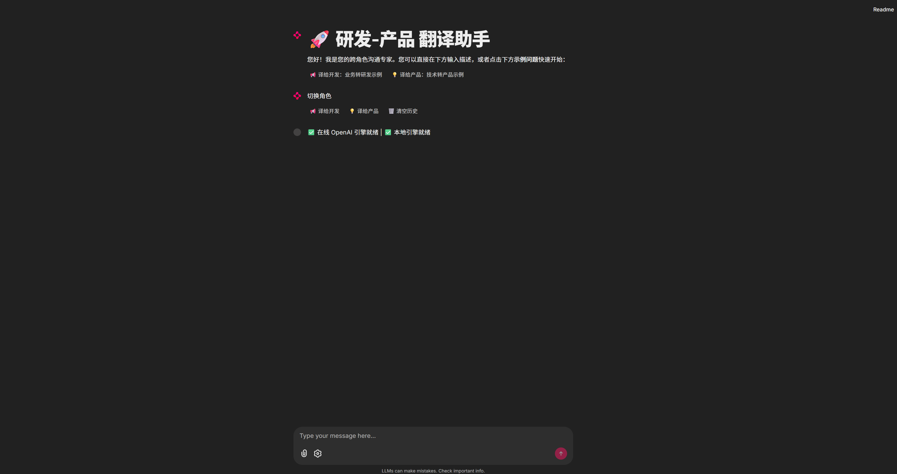
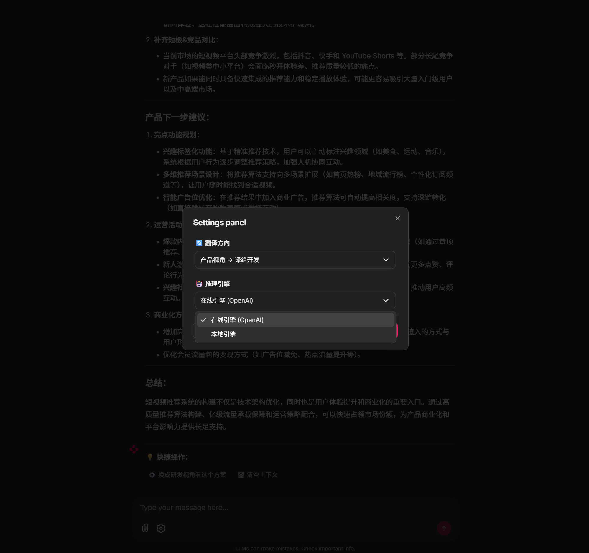
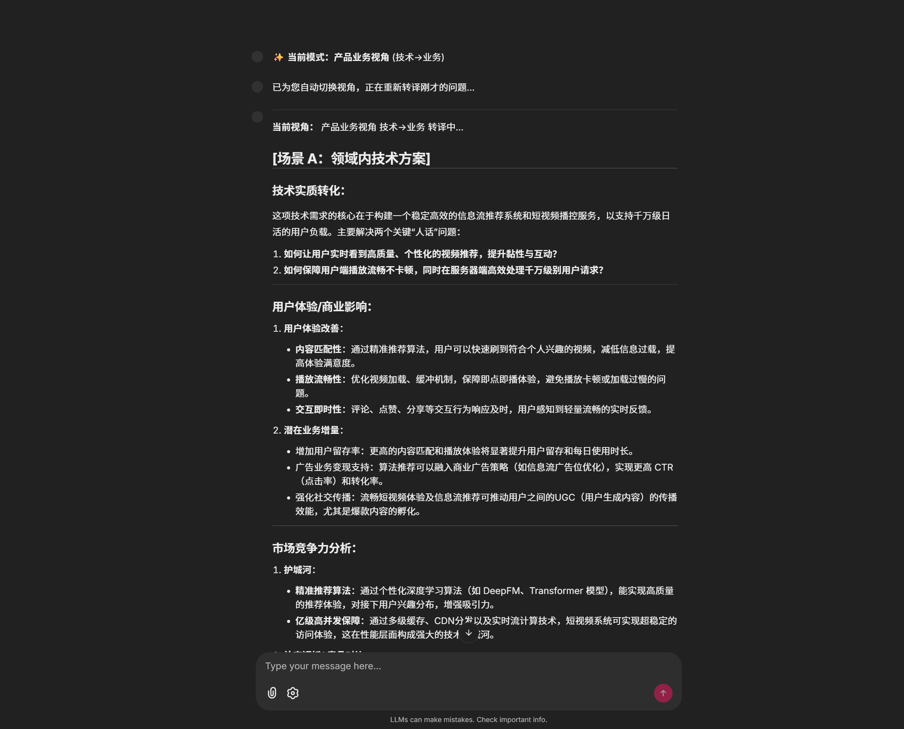
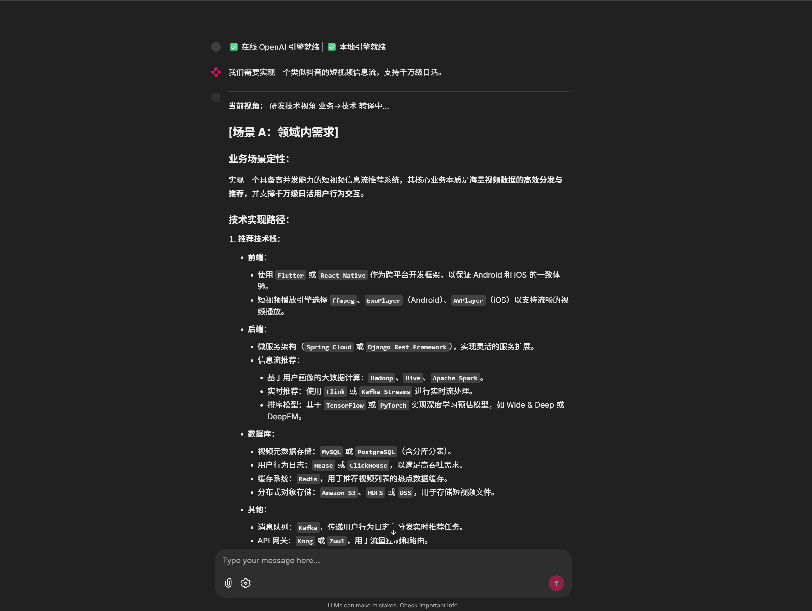
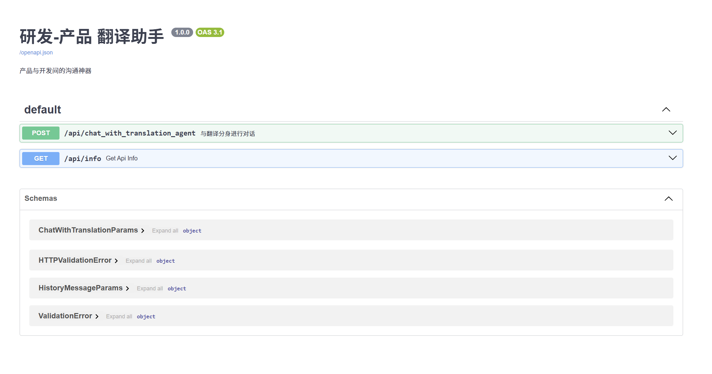

# 🚀 研发-产品 翻译助手 (Dev-Prod Translator)

这是一个基于 **FastAPI** 和 **Chainlit** 构建的智能转译工具。它旨在打破产品经理（PM）与研发人员（RD）之间的“沟通墙”，通过大语言模型将业务需求精准转化为技术方案，或将技术改进转化为商业价值。

---

## 🏗️ 系统架构

本项目采用模块化设计，确保引擎单例运行，同时支持 Web 界面和 API 调用。

- **Core**: `engine_factory.py` 负责大模型的单例加载与管理。
- **Web UI**: 基于 Chainlit，提供直观的对话式翻译体验。
- **API**: 基于 FastAPI，支持第三方系统集成。
- **Engines**: 同时支持本地私有化模型 (Qwen) 和 在线模型 (OpenAI)。

---

## 🛠️ 近期开发计划 (TODO)

### 🟢 基础体验优化 (进行中)
- [x] **引擎单例化**：实现 FastAPI 与 Chainlit 共享同一模型实例，节省显存。
- [x] **智能提示词设计**：引入场景识别逻辑，支持非法输入拦截。
- [x] **流式响应加速**：优化异步 `sleep` 策略，提升首字响应速度（TTFT）。
- [ ] **对话持久化**：将历史记录存储至 SQLite，支持刷新页面后恢复对话。
- [ ] **意图识别**：基于输入问题识别用户真实意图，并进行引导。

### 🟡 功能增强 (计划中)
- [ ] **RAG 插件系统**：支持上传公司内部的《技术规范文档》，让技术方案更符合团队标准。
- [ ] **一键导出功能**：支持将翻译后的技术方案导出为 Markdown 或 PDF 格式。
- [ ] **多角色扩展**：新增 `测试视角`（生成测试用例）与 `运维视角`（生成部署方案）。
- [ ] **用户反馈闭环**：在 UI 增加“点赞/点踩”功能，用于收集 Prompt 调优数据。
- [ ] **思维链**：采用思维链+rag+正负反馈优化agent输出质量。

### 🔴 工业级能力 (愿景)
- [ ] **并发排队系统**：针对本地模型引入 `asyncio.Lock`，解决多人同时调用时的显存争抢。
- [ ] **自动化评估**：引入另一个 LLM 作为裁判，对翻译方案的专业度进行自动评分。
- [ ] **企业级集成**：对接钉钉/飞书机器人，实现群聊中的直接转译。

### 🐞 已知 Backlog
- [ ] 优化 `Starters` 在移动端浏览器的显示布局。
- [ ] 修复 OpenAI API 超时时 UI 挂起的问题。

---

## 📸 产品截图

### 主界面


### 推理引擎和agent切换



### to 产品 


### to 研发



### 在线接口文档



## 🚀 快速开始

1. **环境配置**:
   ```bash
   cp .env.example .env  # 配置你的 API Key 和模型路径
   python3 -m venv venv 
   source  ./venv/bin/activate
   pip3 install -r requirements.txt -i https://pypi.tuna.tsinghua.edu.cn/simple 


2. **本地模型下载**:
   ```bash
   pip install -U huggingface_hub
   # --local-dir 指定下载到当前目录下的文件夹中, 项目默认放置于moduels/checkpoints目录下,亦可在.env文件中指定模型文件夹名称
   huggingface-cli download Qwen/Qwen2.5-7B-Instruct --local-dir ./moduels/checkpoints/Qwen2.5-7B-Instruct

3. **启动服务**:
   ```bash
   # 启动服务
   python3 lanuch.py 
   
   # 指定端口 
   python3 lanuch.py  --port 7860

   # 后台运行
   nohup python3 lanuch.py   > output.log 2>&1 &
   
4. **访问路径**:
   - Web UI: http://127.0.0.1:7860
   - API Docs: http://127.0.0.1:7860/docs


## License

This project is licensed under the Apache 2.0 License.